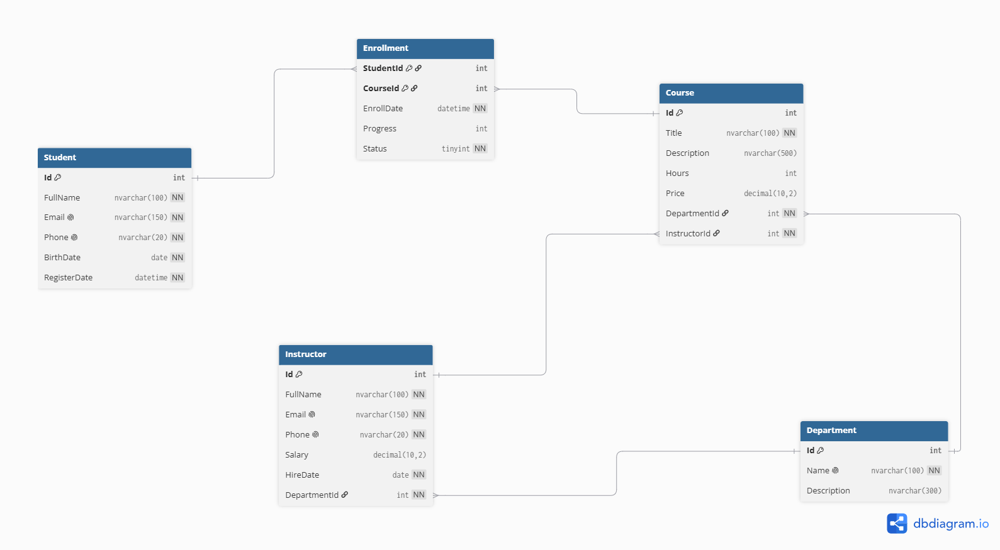
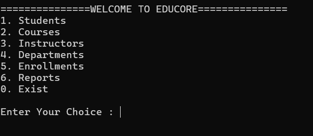

# 🎓 EduCore

A Console-based Learning Management System (LMS) built with **C#**, **.NET**, **Entity Framework Core**, and **SQL Server**.

This project was developed to practice **C#**, **LINQ**, **Entity Framework Core**, **Database Design**, and **Software Architecture** before moving to ASP.NET Core MVC.

---

# 🚀 Features

### 👨‍🎓 Student Management
- Add Student
- Update Student
- Delete Student
- Get Student By ID
- Search Student by Name
- List All Students
- Pagination

### 📚 Course Management
- Manage Courses
- Assign Instructors
- Assign Departments

### 👨‍🏫 Instructor Management
- Manage Instructors
- Department Assignment

### 🏢 Department Management
- Manage Departments

### 📝 Enrollment Management
- Student Enrollment
- Enrollment Progress
- Enrollment Status

### 📊 Reports
- Number of Courses per Student
- Course Statistics
- Department Statistics
- Top 5 Most Popular Courses
- Students Without Courses
- Courses Without Students
- Average Course Price per Department
- Dashboard Summary

---

# 🏗️ Project Structure

```text
EduCore
│
├── Application
│   ├── Interfaces
│   └── Services
│
├── Domain
│   ├── Entities
│   └── Enums
│
├── Infrastructure
│   ├── Configurations
│   ├── Data
│   ├── Repositories
│   ├── Seed
│
├── Migrations 
│
├── View
│   └── Menus
│
├── Program.cs
└── appsettings.json
```

---

# 🗄️ Database Design

The project database consists of the following entities:

- Student
- Course
- Instructor
- Department
- Enrollment

Implemented using:

- Entity Framework Core
- Fluent API
- Composite Primary Keys
- One-to-Many Relationships
- Many-to-Many Relationships
- Check Constraints
- Seed Data

## ER Diagram

```text
ERD.png
```

```md

```

---

# 📸 Screenshots

## Main Menu

```md

```

---

## Student Menu

```md

```

---

## Dashboard

```md

```

---

## Reports

```md


```

---

## Add Student

```md

```

---

# 🛠️ Technologies Used

- C#
- .NET
- Entity Framework Core
- SQL Server
- LINQ
- Fluent API
- Repository Pattern
- Service Layer
- Console Application

---

# 📦 NuGet Packages

The project uses the following NuGet packages:

```text
Microsoft.EntityFrameworkCore

Microsoft.EntityFrameworkCore.SqlServer

Microsoft.EntityFrameworkCore.Tools

Microsoft.EntityFrameworkCore.Design

Microsoft.Extensions.Configuration

Microsoft.Extensions.Configuration.Json

Microsoft.Extensions.Configuration.FileExtensions

Microsoft.Extensions.Configuration.Binder
```

You can restore all packages using:

```bash
dotnet restore
```

or simply open the solution using Visual Studio.

---

# ⚙️ Getting Started

## 1. Clone the Repository

```bash
git clone https://github.com/YOUR_GITHUB_USERNAME/EduCore.git
```

---

## 2. Open the Project

Open the solution using **Visual Studio 2022**.

---

## 3. Restore NuGet Packages

```bash
dotnet restore
```

---

## 4. Configure SQL Server

Open:

```text
appsettings.json
```

Replace the connection string with your own SQL Server instance.

Example:

```json
{
  "constr": "Data Source=YOUR_SERVER;Initial Catalog=EduCore;Integrated Security=True;TrustServerCertificate=True;"
}
```

---

## 5. Create the Database

Run the existing migrations.

Using Package Manager Console:

```powershell
Update-Database
```

or using .NET CLI:

```bash
dotnet ef database update
```

The database will be created automatically and all **Seed Data** will be inserted.

---

## 6. Run the Project

Press **F5** in Visual Studio

or

```bash
dotnet run
```

---

# 📊 Available Reports

- Students and Number of Enrolled Courses
- Courses with Student Count
- Department Statistics
- Top 5 Popular Courses
- Students Without Enrollments
- Courses Without Students
- Average Course Price by Department
- System Dashboard

---

# 📚 What I Learned

During this project I practiced:

- Object-Oriented Programming (OOP)
- Entity Framework Core
- Fluent API
- SQL Server
- LINQ
- Navigation Properties
- Repository Pattern
- Service Layer
- Database Design
- Seed Data
- Console Application Architecture
- Reporting using LINQ

---

# 🔮 Future Improvements

- ASP.NET Core MVC
- Dependency Injection
- Authentication & Authorization
- Generic Repository
- Async Repository
- Validation
- Search & Filtering
- Sorting
- Unit Testing
- Logging

---

# 👨‍💻 Author

**Abdelrahman Mohamed**

.NET Backend Developer

GitHub:
https://github.com/YOUR_GITHUB_USERNAME

LinkedIn:
https://linkedin.com/in/YOUR_LINKEDIN

---

# ⭐ If you like this project

Please consider giving it a **Star ⭐** on GitHub.
